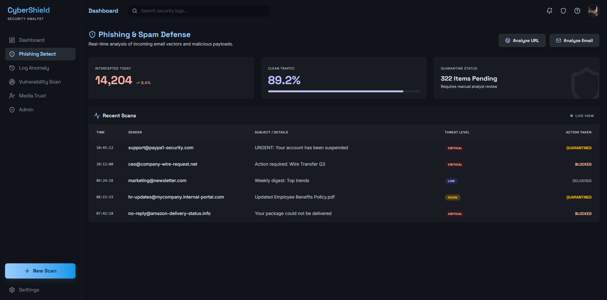
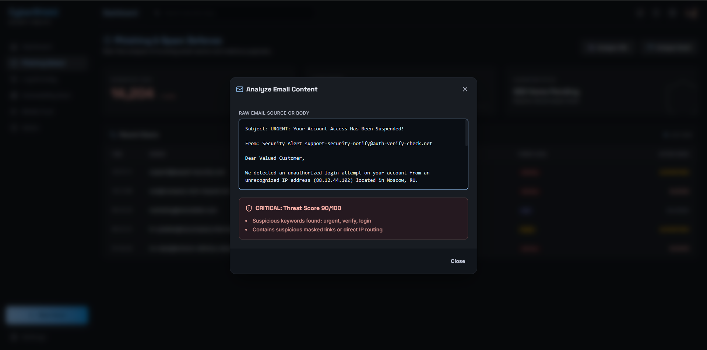

# build-with-ai
# CyberShield Dashboard

## Problem Statement
Traditional security interfaces are often clunky, static, and difficult to navigate, making proactive threat detection and response a hassle for cybersecurity professionals. Analysts need faster, more intuitive, and highly responsive tools to analyze phishing attempts, anomalous behavior, and vulnerabilities effectively in real time.

## Project Description
CyberShield is a modern, responsive, and fully interactive glassmorphic web dashboard designed specifically for security analysts. 
It features seamless dynamic tab navigation, real-time simulated environment threat tracking, and a dedicated **Phishing Detect Module** powered by a custom **Heuristic Scoring Engine**. This built-in engine actively analyzes pasted raw email content or targeted website URLs, algorithmically breaking down threats by keywords, link mapping, behavioral formatting, and DNS infrastructure checks to surface actionable insights.

---

## Google AI Usage
### Tools / Models Used
- Google AI / Anthropic (via Google's Agentic IDE Integration)

### How Google AI Was Used
Google AI functioned as an autonomous pair-programmer for this project. The AI agent was utilized to architect the frontend React components, assemble the Tailwind CSS glassmorphism design system, implement interactive Framer Motion animations, generate realistic mock cybersecurity log data, and program the JavaScript heuristic scoring logic that powers the email and URL phishing scanners.

---

## Proof of Google AI Usage
Attach screenshots in a `/proof` folder:


---

## Screenshots 
Add project screenshots:

  


---

## Installation Steps

```bash
# Clone the repository
git clone <your-repo-link>

# Go to project folder
cd cybershield

# Install dependencies
npm install

# Run the project (Vite Development Server)
npm run dev
```
